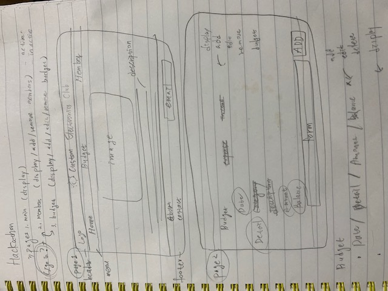
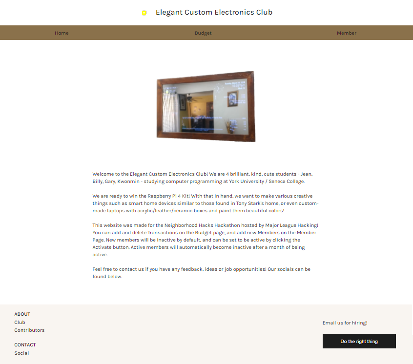
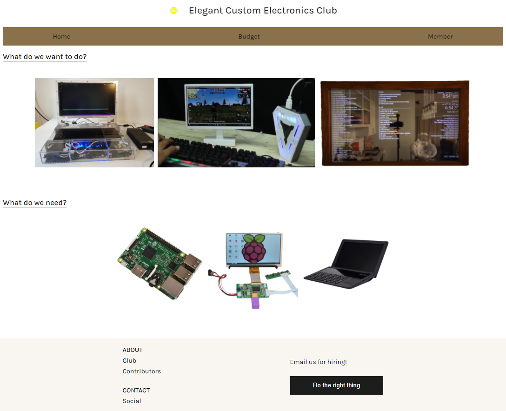
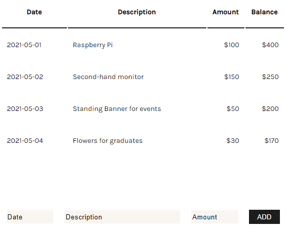
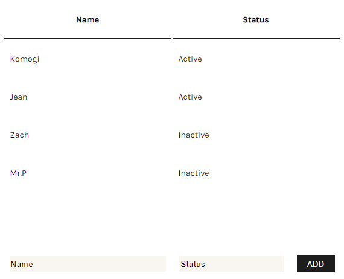

## 📑 Hackathon 2021 May 14-16th Neighborhood Hacks  
Hackathon      https://neighborhoodhacks.devpost.com/?ref_feature=challenge&ref_medium=discover  
Our app        http://li2280-24.members.linode.com/  
Our submission https://devpost.com/software/club-ledger-app  

---

#### Goal: winning for the best use of Linode (Raspberry Pi 4 Kit)

   

Use any one of Linode's wide array of cloud products and take your hack to the next level! Whether you're looking for data storage, compute power or hosting, Linode has what you need and the complimentary credits to get you started. Sign up and start hacking for your chance to win a Raspberry Pi 4 Starter Kit.  

---

## ✏️ Proposal: Club Budget & Member Managing App  

#### Motivation:
School clubs have sometimes difficulty managing budgets for various activities, especially if the club has a monthly membership fee. An application that can act as a ledger for those clubs and a list of active members at the same time will help with this problem.  

#### Description:
Application for a small group that manages its fundings and expenses. Manager (or someone responsible for the finance of the group) can easily add funding for the month, keep a list of the members and manage membership for each member (membership fee is automatically added to the month’s funding), deduct funds for expenses, and see how much remaining funding the group has each month.  

---

## 📎 PLAN

#### CLUB NAME: Elegant Custom Electronics Club (ECCE)  

#### TEAM STRUCTURE: 4 people  
  
Jean     - front-end  
Billy    - back-end  
Gary     - back-end  
Kwonmin  - back-end  

#### STACK  

React (Router, Styled Components), JS, HTML, CSS, Adobe, and Linode  

#### FEATURE  

- Simple Ledger (earned money through budget, membership fee, etc. and expenses)  
- List of members (past and present) and active members  

#### THINGS TO DISCUSS
- Managed by one (easier) or many (harder)?
- How to store relevant data: text file (easiest), database (bit harder), or cloud storage (bit harder + cost money but fancy)
- Type of application: webpage (JavaScript, HTML, CSS, React), mobile app (Android Studio), desktop app (Python or Java Third-Party Library), or else.
- Language choice (Java? Python? JavaScript/TypeScript? C++?)

---

## ✏️ WIREFRAMING

  

---

#### - HOME 

  

---

#### - ABOUT

  

---

#### - BUDGET

  

---

#### - MEMBER

     

  
---
